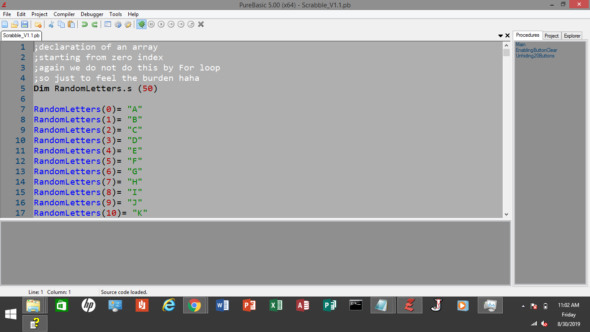

# PureBasic Projects

When you are at GitHub, every subdirectory of this repo 
is a separate sample project that you can use 
if you have a similar project.
The good thing is that when you click download or clone,
these separate projects will be downloaded together with
the parent directory. But when you are viewing this
right now as web page in `mongalvarez.github.io` domain,
you need to click `View on GitHub` to download the
source codes.

Thanks!

I truly believe learning PureBasic is worth it 
more than other BASIC dialects.

The author of this language said that he will never 
add the concept of objects, as in objects used in
object-oriented programming.
And that is great. Other BASIC dialects added new functionalities,
including those that were not meant 
to be for the BASIC language.

The reason why I am using this is to feel the BASIC language back then.
And that is great, because when you want to do some
object-oriented programming, you do it in other languages, like Java.
I stay with the simplicity of PureBasic when I want to deal with
the simplicity of the BASIC language.

Take for example the C language.
It is still the most respectable
C language from the past, known for system programming.
Other programming languages were built
from C with objects and classes. But C remained just like that.
My point here is, the identity of different
programming languages staying the same through
the years, somewhat an old-fashioned yet still a relevant one.

So, in the end, PureBasic is one of the best BASIC dialects.

## PureBasic Highlights
> - PureBasic is a structured programming language. PureBasic retained
`Goto` but as a structured programming language, instead of 
focusing in `Goto`, we can use functions through procedures
instead, although as a
BASIC dialect, it does not have the `main` function.
>
> - PureBasic can call user-defined functions through an include
command, that is `XIncludeFile` (and `IncludeFile`). This is a very 
important one because in the past,
the tendency was to put everything in just one source file.    
>
> - PureBasic uses single `=` sign for both assignment and comparison
operators.
>
> - PureBasic has a very good GUI components. This can be used when, say,
one programmer in C created purely a console app. In this case, all
you need to do is to interface using the `stdout` of that console app
and your GUI program can communicate well with the console app.
>
> - PureBasic simplified the process of creating executable files
and the IDE is very good.
>
> - PureBasic is for hobbyist and still can be used for creating
apps for business solutions.
>
> - PureBasic might be very famous in the open source projects
if this was an open source too.
>
> - PureBasic might be more than Visual Basic if not because
of Microsoft. We all know how powerful Microsoft is. 
It toppled many business competitors.
>
> - PureBasic is a cross-platform programming language but
works well in Windows OS. 
>
> - PureBasic added the user-defined data type `structure`.
This is a very useful data type to manage and organize data.

## Compiling
To compile/run each project in a subdirectory, 
just use the PureBasic IDE. In just few clicks,
you are good to go.

## Contributing
1. Fork the repo!
2. Then, made changes and create a pull request. 
I'm happy you contribute!
3. In case you don't want to fork this,
please star this if you find this informative. Thanks! 

## License
MIT - the permissive license
