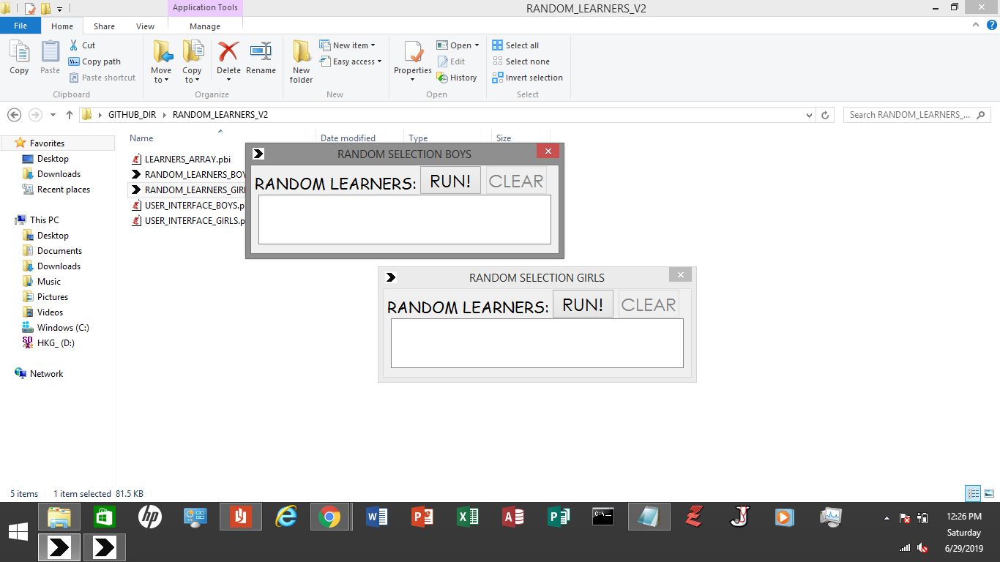

# PureBasic Random Data 
This is a small program that can randomly call learners. 
In the source code, you will see a lot of random generation by the machine. 
You can totally change these things as per requirement of yours.

## Compiling
To compile/run, just use the PureBasic IDE, that's very fast and
simple for simple programs like this.

## Contributing
1. Fork it!
2. Then, made changes, and create a pull request. I'm happy you contribute to my repo!

## License
MIT- The permissive license
