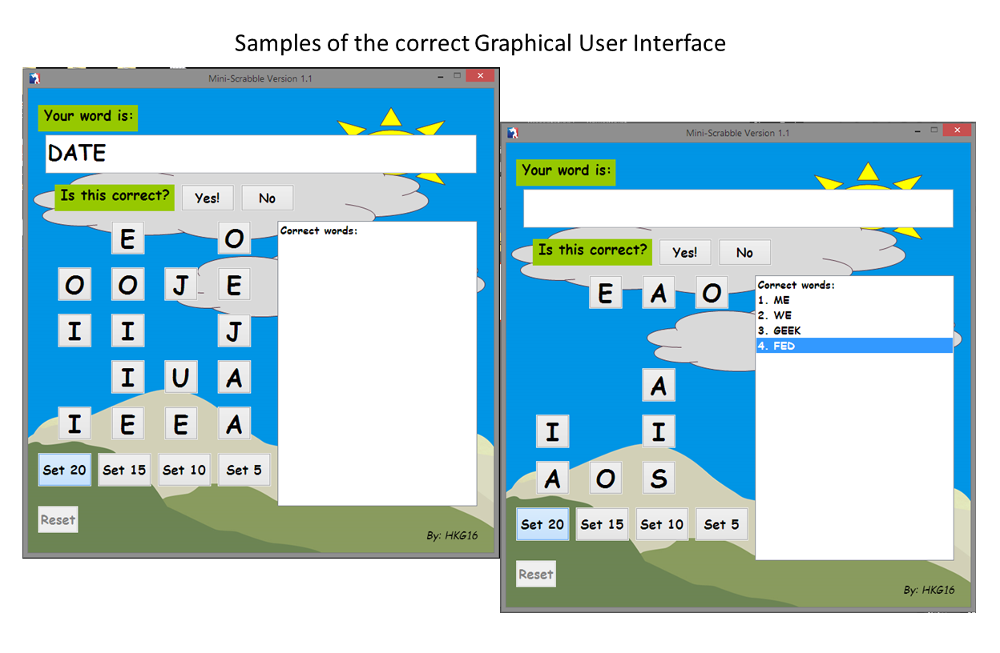

<!-- Global site tag (gtag.js) - Google Analytics -->

# PureBasic Mini-Scrabble
This is a scrabble game written in PureBasic.

When playing, better play this 
with a dictionary,
I intentionally did not include any standard dictionary
so that learners/students will be engaged in 
playing this game, doing some manual
researches for those words.

There are four sets
and when you click 'Reset'
your score/s will be counted.

And you can always change these things as per requirement of yours.

## Compiling
To compile/run, just use the PureBasic IDE, that's very fast and
simple for simple programs like this.

## Contributing
1. Fork it!
2. Then, made changes, and create a pull request. I'm happy you contribute to my repo!

## License
MIT- The permissive license
